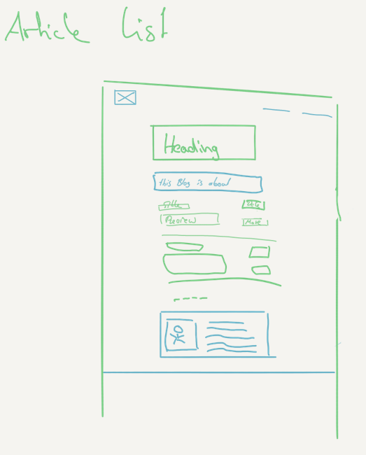
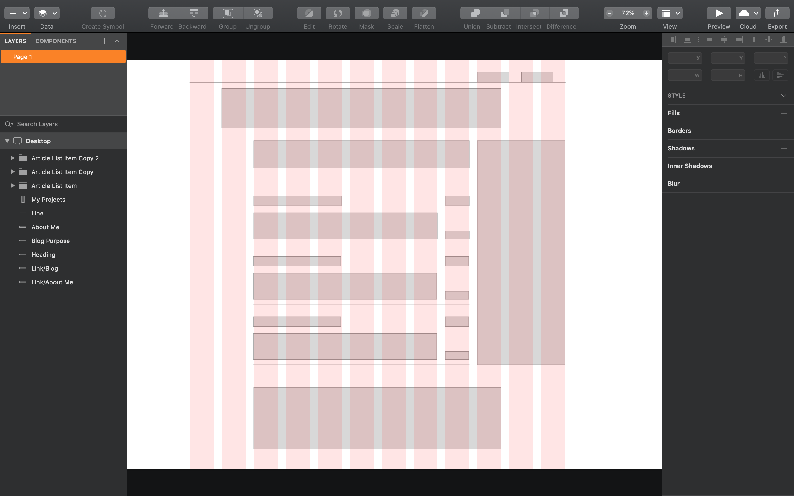
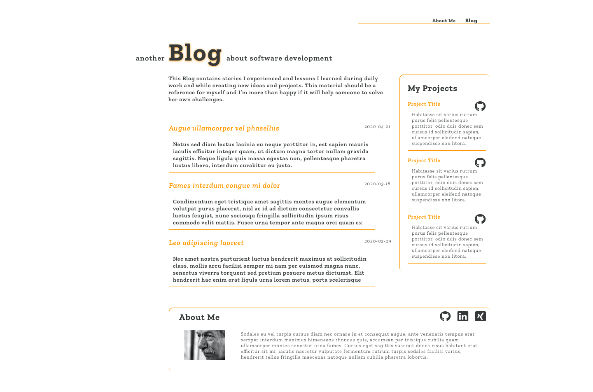

I've been playing with the idea of creating my own blog for a long time. I played with [ghost](https://ghost.org "ghost") a few years ago because I was some kind of [Node.js](https://nodejs.org/en/) enthusiast and wanted to try hosting this on my personal NAS. After I learned how easy it is to host a private page with Github I also tried Jekyll. With both approaches I felt uncomfortable creating my own theme. Additionally I wanted to use the whole blog project as something which I can build from scratch.

Because I haven’t brought my journey to an end the last times, I thought I can create pressure by starting the project with paying real money. So the first thing I did this time was purchasing the domain: [jmeischner.com](https://www.jmeischner.com). 

I wanted to host the blog with Github Pages so that I need a CNAME Record for my domain. I decided to manage my domain with [Digital Ocean](https://www.digitalocean.com/?utm_campaign=DO_Dev_Awareness_G_Search_B_Generic_Alpha&utm_adgroup=digital_ocean&_keyword=digital%20ocean&_device=c&_copytype=&_adposition=&utm_medium=brand_sem&utm_source=google&_dkitrig=&_2dkitrig=&gclid=EAIaIQobChMI0-DsntDA6QIVheJ3Ch128wYAEAAYASAAEgL9C_D_BwE) since I want to use it for another project in the near future and I like to have these things administrated in one place.

## Design Phase

Also something new for me: I didn’t make the decision for the technology stack beforehand. I decided to go with the design first. I read a very inspiring [article series](https://www.git-tower.com/learn/build-your-own-blog/concept/why-build-your-own#start) from [git-tower](https://www.git-tower.com/mac) and after 2 years of absence from using [Sketch](https://www.sketch.com) I made an Udemy Course called [Sketch from A to Z ](https://www.udemy.com/course/learnsketch3/) to refresh my Sketch knowledge.

I finally started to create a rough design draft in [paper](https://paper.bywetransfer.com).



And brought it to Sketch.



Thereafter I started to look for a font and colors I like. I ended up with [Zilla Slab](https://fonts.google.com/specimen/Zilla+Slab) as serif font and [Work Sans](https://fonts.google.com/specimen/Work+Sans) as sans serif font. To find matching colors I browsed [colourlovers](https://www.colourlovers.com) which is a bit cluttered with advertisement but has a huge amount of palettes and colors. A simple orange caught my eye as the highlighting color and I use a dark gray as primary text color.

So before I started the implementation I ended up with the following Sketch design.



## Implementation Phase

I have used react at work and we have just started a new project with [create-react-app](https://create-react-app.dev) so that I was curious to explore an alternative. I ended up with [Gatsby](https://www.gatsbyjs.org). As a static page generator it integrates perfectly with Github Pages and with its built-in markdown transformation plugin it serves my need of having a markdown based blog system.

While working with *Vue.js* I got used to the *single file components* approach. Besides different other solutions I wanted to give the [styled components](https://styled-components.com) idea a chance and started to create 2 basic *Flexbox* components to implement my design — *Container* and *Item*.

```js
/** Container **/
import styled from 'styled-components'

const Container = styled.div`
  align-content: ${p => (p.alignContent ? p.alignContent : "stretch")};
  align-items: ${p => (p.alignItems ? p.alignItems : "stretch")};
  display: flex;
  flex-direction: ${p => (p.direction ? p.direction : "row")};
  flex-wrap: ${p => (p.wrap ? p.wrap : "nowrap")};
  justify-content: ${p => (p.justifyContent ? p.justifyContent : "flex-start")};
  width: 100%;
`
export default Container

/** Item **/
import styled from 'styled-components'

const Item = styled.div`
    flex: ${p => p.shrink ? p.shrink : 0} ${p => p.grow ? p.grow : 1} ${ p => p.basis ? p.basis : p.width ? p.width * 80 + 'px' : 'auto' };
    align-self: ${p => p.align ? p.align : 'auto'};

    @media (${p => p.theme.media.small}) {
        flex-basis: auto;
    }
`

export default Item
```

I used these components as base elements for most of the other styled-components `js·const myComponent = styled(Container)`. To get the styled-component library working with the Gatsby production build it‘s necessary to use the [gatsby-plugin-styled-components](https://www.gatsbyjs.org/packages/gatsby-plugin-styled-components/#gatsby-plugin-styled-components), otherwise there could be some strange effects that some styles do not apply or you can see the full page without styling for a short moment before the page renders correctly.

Additionally I created an overall theme with the global styling parameters I potentially want to play with in the future and which I want to reuse throughout my blog.

```js
const theme = {
  fontFamily: "'Zilla Slab', serif",
  color: {
    primary: "#343838",
    secondary: "#FF9900",
  },
  zilla: {
    light: 300,
    regular: 400,
    semibold: 600,
    bold: 700
  },
  fontSize: {
    h1: "24px",
    h2: "22px",
    h3: "20px",
    m: "18px",
    s: "16px",
    sm: "14px",
    xsm: "12px"
  },
  media: {
    small: "max-width: 576px",
    medium: "max-width: 768px",
    large: "max-width: 992px",
  }
}

export default theme
```

The next big step was to setup the markdown transformer. Fortunately this is one of the basic features Gatsby ships with, so that I could follow the intermediate tutorial starting from the [transformer plugins](https://www.gatsbyjs.org/tutorial/part-six/) chapter. As described there I started with filling my *article list page*, which is an overview about the existing posts. Thereupon I followed the chapter [programmatically create pages from data](https://www.gatsbyjs.org/tutorial/part-seven/) to create the actual *blog post page* from a markdown document.

For the *blog post page* I additionally added [gatsby-remark-vscode](https://www.gatsbyjs.org/packages/gatsby-remark-vscode/) which I wanted to use to display containers with syntax highlighting in my blog posts. To get this plugin working with a smaller viewport width I needed a weird css quirk:

```css
.grvsc-line {
  width: 0;
}
  
.grvsc-code {
  min-width: 0;
}
```

Finally I struggled a bit with a tool to write the actual blog posts. I am a big fan of [bear](https://bear.app) and as far as I made all notes concerning this current story in bear I started to write the text there also. I found the markdown export functionality not sufficient enough, so that I tried [Ulysses](https://ulysses.app) again after some years. Unfortunately the export didn‘t fit my needs again and more pivotal was, that I had serious problems with the iCloud sync. I am now writing these sentences in bear and will try to build a custom workaround for the *frontmatter* part of the document.

Thank you for reading so far and I‘m glad that I have finished my first blog post now.

## Link Collection
- [Article series](https://www.git-tower.com/learn/build-your-own-blog/concept/why-build-your-own#start) with hints how to build an own blog
- Managing a [custom domain for a Github pages site]([https://help.github.com/en/github/working-with-github-pages/managing-a-custom-domain-for-your-github-pages-site])
- All around [colors](https://www.colourlovers.com)
