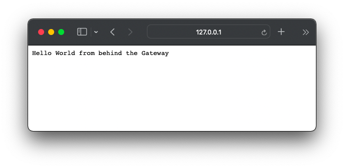

In this post I want to describe how to setup a local Minikube environment with an API Gateway solution called [KrakenD](https://www.krakend.io). An API Gateway acts as a reverse proxy and ingress for your cluster containing all further backend services. It can handle rate limiting, authentication, data aggregation and/or manipulation and many more. KrakenD is a fast solution to create such a gateway by using simple JSON configuration.

A [Kubernetes LoadBalancer](https://kubernetes.io/docs/concepts/services-networking/service/#loadbalancer) is a special type of Kubernetes service which directs traffic from external sources to the internal backend pods. So that is the kind of thing we want to combine with the krakenD API Gateway.

The prerequisites for this adventure are
- `docker` installed
- `kubectl` installed
- `minikube` installed

Let’s begin by starting the Minikube cluster

```sh
minikube start
```

This command creates the cluster and should end with

```sh
🏄  Done!
```

To get the `LoadBalancer` up and running we need a KrakenD image first. This is really simple, because all KrakenD needs is a simple configuration file. By taking the provided base image it is nothing else than

```Dockerfile
# Dockerfile
FROM devopsfaith/krakend

ADD ./krakend.json /etc/krakend/krakend.json

EXPOSE 8080
```

To improve this a next step could be to put this configuration into a Kubernetes `ConfigMap` but let us start here.

Create the most basic *krakend.json* with the content
```json
{
	"version": 2
}
```

in the same directory like the *Dockerfile*. To push the image into the local directory used by the Minikube cluster execute

```sh
eval $(minikube docker-env)
```

And continue building the image within the same terminal session with

```sh
docker build . -t krakend-api-gateway
```

To deploy this into the Kubernetes cluster I use the following definition.

```yaml
# k8s.yml
apiVersion: v1
kind: Service
metadata:
  name: api-gateway
spec:
  type: LoadBalancer
  selector:
    app: krakenD
  ports:
    - protocol: TCP
      port: 80
      targetPort: 8080
---
apiVersion: apps/v1
kind: Deployment
metadata:
  name: krakend-deployment
  labels:
    app: krakend-api-gateway
spec:
  replicas: 1
  selector:
    matchLabels:
      app: krakenD
  template:
    metadata:
      labels:
        app: krakenD
    spec:
      containers:
        - name: api-gateway
          image: krakend-api-gateway
          ports:
            - containerPort: 8080
          imagePullPolicy: Never
          command: ["/usr/bin/krakend"]
          args: ["run", "-d", "-c", "/etc/krakend/krakend.json", "-p", "8080"]
```

Here the service definition includes the `type: LoadBalancer`. This makes the service a `LoadBalancer` one which should handle external traffic.

To get this into the Minikube cluster it takes nothing more than

```sh
kubectl apply -f k8s.yml
```

This creates the `LoadBalancer` Kubernetes service and deploys one replica of the KrakenD image containing our configuration.

Let’s assume there is a second service running in the cluster which contains a web service with a `/hello-world` route. And let’s assume the service is called `hello-world-service`. We now want to connect our api-gateway to direct incoming traffic to that route via the external `/hello-gateway` route.

This is now done in the *krakend.json* configuration file and is basically as simple as

```json
{
  "version": 2,
  "timeout": "3000ms",
  "cache_ttl": "300s",
  "name": "API - Gateway",
  "endpoints": [
    {
      "endpoint": "/hello-gateway",
      "output_encoding": "string",
      "method": "GET",
      "backend": [
        {
          "url_pattern": "/hello-world",
          "encoding": "string",
          "sd": "dns",
          "method": "GET",
          "host": ["hello-world-service"],
          "disable_host_sanitize": true
        }
      ]
    }
  ]
}
```

By setting `“sd“: „dns“` we tell KrakenD, that it should resolve the `“host“:“hello-world-service“` by the given DNS. It’s also crucial to use `"disable_host_sanitize": true` while working with a service discovery in KrakenD. Nevertheless this makes the configuration rather convenient.

If `kubectl get svc` gives you the following

```sh
➜ kubectl get svc
NAME                  TYPE           CLUSTER-IP      EXTERNAL-IP   PORT(S)        AGE
api-gateway           LoadBalancer   10.110.59.77    <pending>     80:31299/TCP   18m
hello-world-service   ClusterIP      10.107.30.157   <none>        8080/TCP       4s
kubernetes            ClusterIP      10.96.0.1       <none>        443/TCP        34m
```

there is only one last step missing. The last step transform the `EXTERNAL-IP: <pending>` into our localhost ip. It is

```sh
minikube tunnel
```

When you execute `kubectl get svc`, you should see `EXTERNAL-IP: 127.0.0.1` for the *api-gateway*

🎉 By open `http://localhost/hello-gateway` you should get something like


**Quick Note**

It’s also rather easy adding e.g. authentication via [Auth0](https://auth0.com) by following the given [provided description](https://www.krakend.io/docs/authorization/auth0/).

## Link Collection
- [Kubernetes](https://kubernetes.io)
- [KrakenD - Open source API Gateway](https://www.krakend.io)
- [minikube](https://minikube.sigs.k8s.io/docs/)
